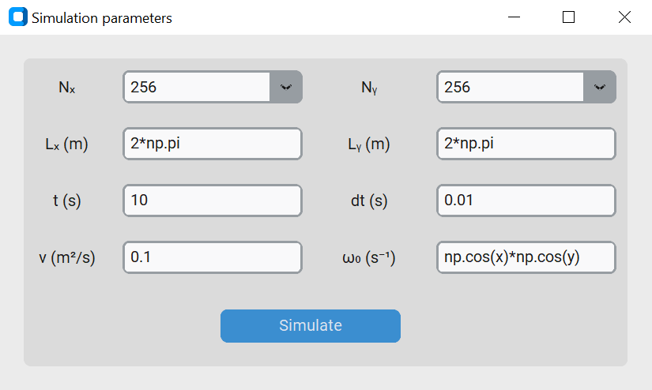

# fluid_sim_2d

### ABOUT
WIP: A 2D simulation of an incompressible, viscous fluid built with Fortran90, wrapped with Python 3.11 via gfort2py.

DISCLAIMER: This is an experiment on solving PDEs via Fourier Transform. This implies the simulation only works with periodic boundary conditions and is subject to the Gibbs phenomenon. In future simulations I plan on using Chebyshev transforms.

### PREVIEW

### HOW TO USE

1. Clone the repository and open its folder from the CLI.
1. Run the command `pip install -r requirements.txt` to install dependencies.
1. Run the command `python main.py`.
1. A GUI with some predefined values will open. Here you can modify the parameters of the simulation with Python and NumPy expressions. The number of grid points is controlled by `Nx` and `Ny`, the grid's side lengths `Lx` and `Ly` should evaluate to floats. Viscosity (`nu`), duration (`t`) and time step (`dt`) should also evaluate to floats. The vorticity field should evaluate to a real 2D NumPy $(N_y, N_x)$ array &mdash; you may use any of the simulation parameters as well as `x` and `y` to define it.

  

5. Wait while the programme loads a Matplotlib window.

### COPYRIGHT

This project makes use of the FFTW library, retrieved from https://www.fftw.org/install/windows.html. The code is licensed under a GNU General Public License, therefore so is my project (see `COPYING`). Note that my code doesn't include the library in its totality, only the necessary files.

### TROUBLESHOOTING

If need be, you can `cd` into the `fluid_sim` folder and run the following command to recompile the Fortran code, provided you have gfortran installed:

`gfortran fluid_sim.f90 -o fluid_sim.mod -o fluid_sim.dll -shared -L../ -lfftw3-3` 

### THEORY

The incompressible Navier-Stokes equation, assuming linear stress, Stokes' hypothesis and constant kinematic viscosity reads:

$$
\begin{equation}
\frac{\partial\boldsymbol{u}}{\partial t}+\boldsymbol{u}\cdot\nabla\boldsymbol{u}=
-\frac{\nabla p}{\rho}+\boldsymbol{g}+\nu\nabla^2\boldsymbol{u}
\end{equation}
$$

It is convenient to define the **vorticity** as $\boldsymbol{\omega}=\nabla\times\boldsymbol{u}$, more explicitly in 2D

$$
\omega=\frac{\partial u_y}{\partial x}-\frac{\partial u_x}{\partial y}
$$

Taking the curl of Equation (1) in 2D then leads to the following, in terms of vorticity,

$$
\begin{equation}
\frac{\partial\omega}{\partial t}+\boldsymbol{u}\cdot\nabla\omega=\nu\nabla^2\omega
\end{equation}
$$

Since for an incompressible fluid $\nabla\cdot\boldsymbol{u}=0$, we may write that, in terms of a vector potential called the **stream function** $\boldsymbol{\psi}$, $\boldsymbol{u}=\nabla\times\boldsymbol{\psi}$. More simply in 2D 

$$
\begin{align*}
u_x &= \frac{\partial\psi}{\partial y}\ \ \ \ \ \ \ &
u_y &= -\frac{\partial\psi}{\partial x}
\end{align*}
$$

So we may rewrite Equation (2) as

$$
\begin{equation}
\frac{\partial\omega}{\partial t}=\left(\frac{\partial\psi}{\partial x}\frac{\partial}{\partial y}-\frac{\partial\psi}{\partial y}\frac{\partial}{\partial x}\right)\omega+\nu\nabla^2\omega
\end{equation}
$$

And we find that one can recover $\psi$ from the Poisson equation 

$$
\nabla^2\psi=-\omega
$$

In order to solve Equation (3) we must perform some numerical time integration. At each step we'll have to recalculate $\psi$. We still also need to figure out how to calculate spatial derivatives to solve the PDE, but notice that in Fourier space

$$
\mathscr{F}_x\left(\frac{\partial^k\cdot}{\partial x^k}\right) \rightarrow (ik_x)^k\mathscr{F}_x(\cdot)
$$

$$
\mathscr{F}_y\left(\frac{\partial^k\cdot}{\partial y^k}\right) \rightarrow (ik_y)^k\mathscr{F}_y(\cdot)
$$

If the simulation is on a $L_x\times L_y$ grid of $N_x\times N_y$ points, we may discretise the (truncated) spectrum of wavenumbers as 

$$
\begin{align*}
k_{x_i} &= \frac{2\pi i}{L_x}\ \ \ \ \ \ \ &
i &=0,1,...,\frac{N_x}{2}-1,-\frac{N_x}{2},...,-2,-1
\end{align*}
$$

$$
\begin{align*}
k_{y_j} &= \frac{2\pi j}{L_y}\ \ \ \ \ \ \ &
j &=0,1,...,\frac{N_y}{2}-1,-\frac{N_y}{2},...,-2,-1
\end{align*}
$$

This also helps us solve for $\psi$, since if we call $\mathbf{k}=(k_x,k_y)^\mathrm{T}$,

$$
\mathscr{F}(\psi) = \frac{1}{\Vert\mathbf{k}\Vert^2}\mathscr{F}(\omega)
$$

Denoting by $\ \hat{}$ ${}$ the 2D Fourier transform in x and y and by $*$ the 2D convolution, the equation to solve then becomes

$$
\begin{equation}
    \frac{\partial\hat{\omega}}{\partial t} = 
    \left(\frac{k_y}{\Vert\mathbf{k}\Vert^2}\hat{\omega}\right)*(k_x\hat{\omega})-
    \left(\frac{k_x}{\Vert\mathbf{k}\Vert^2}\hat{\omega}\right)*(k_y\omega)-
    \nu\Vert\mathbf{k}\Vert^2\hat{\omega}
\end{equation}
$$

So far this naive implementation could suffer from **aliasing** in the nonlinear convection term of the RHS (the one with convolutions). When performing a discrete Fourier transform, too high frequencies could be treated as low frequencies. To solve this we pad all arrays with zeros, perform the operations on $3/2N$ points, and truncate the result back to $N$ points.

For brevity, let's denote the nonlinear convection term by $\mathcal{N}(\hat{\omega})$. We can "pull out" the linear part of the PDE using an integrating factor.

$$
\begin{equation}
\frac{\partial}{\partial t}(\hat{\omega}e^{\nu\Vert\mathbf{k}\Vert^2t})= e^{\nu\Vert\mathbf{k}\Vert^2t}\mathcal{N}(\hat{\omega})
\end{equation}
$$

And if we approximate the nonlinear part as constant over each time step we end up with the simplest **exponential time-differencing** scheme:

$$
\begin{equation}
\hat{\omega}_{n+1} \approx e^{-\nu\Vert\mathbf{k}\Vert^2\Delta t}\hat{\omega}_n - \frac{e^{-\nu\Vert\mathbf{k}\Vert^2\Delta t}-1}{\nu\Vert\mathbf{k}\Vert^2}\mathcal{N}(\hat{\omega}_n)
\end{equation}
$$